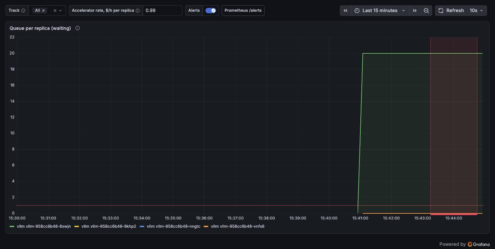
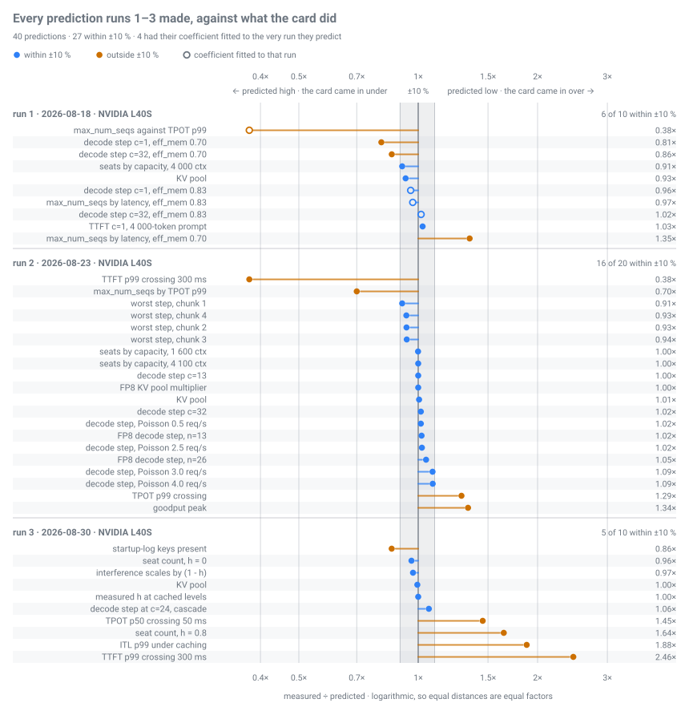

# i-serve

A slice of an LLM inference operator's platform: one open-weights model served
on Kubernetes, with every number derived from that model's `config.json` and the
card under it; today that model is Qwen3-8B. It answers the operator's three
questions in the order they arrive —
[**1. Speed**](#1-speed--how-fast-should-each-word-appear),
[**2. Cost**](#2-cost--what-does-a-million-tokens-cost-at-that-speed),
[**3. Trouble**](#3-trouble--it-got-slow-where-do-you-look-first).

[](https://alexgitspace.github.io/i-serve/)

**[Open the page →](https://alexgitspace.github.io/i-serve/)** — all three,
draggable, nothing installed. Below is the stack behind them.

## What is real here

The vocabulary — seat, TTFT, TPOT, SLO, prefix cache, run, runsheet, `kind`,
stub — is [docs/GLOSSARY.md](docs/GLOSSARY.md). §N is a section of
[docs/SLO.md](docs/SLO.md) unless a report is named.

Numbers come in three kinds, never mixed:

- **measured** — by a run on a rented card, raw evidence in
  [docs/benchmarks/raw/](docs/benchmarks/raw/). Three L40S runs so far; two
  coefficients fitted on run 1 survived runs 2 and 3.
- **derived** — in [docs/SLO.md](docs/SLO.md); a prediction until measured, and
  outranked by vLLM's own startup log ([§9](docs/SLO.md)).
- **prior** — spec-sheet coefficients for a card no run has faced. The MI300X's
  runsheet is reviewed, its run not made.

`kind` runs the stack against a stub and shows what the system *does*, never
what the numbers *are*. What it cannot show, and what is fixture:
[docs/audience.md](docs/audience.md#what-is-real-on-kind-and-what-is-not).

## 1. Speed — how fast should each word appear?

Readers notice anything slower than about 50 ms per word. At that promise an
L40S seats **12 people with a cold cache and 32 when 80 % of each prompt
repeats** — measured, TPOT p99 ≤ 50 ms, 4 000-token prompts
([docs/benchmarks/](docs/benchmarks/)). The arithmetic says 31 seats before
arriving prompts are priced in, and names the limit: *time* (the decode step
grows per seat) or *room* (the KV pool holding every context fills). Pricing
arriving prompts in lowers that row; run 3 beat it ([The proof](#the-proof)).

The target is yours; picking it by feel is not. Both presets, interactive and
batch, are derived ([§2](docs/SLO.md#2-targets)) and are two obligations, not
two numbers ([§1](docs/SLO.md#1-workload-classes)).

Page, step 1: seats the hardware allows, seats you can promise, the first-word
wait. Docs: floors [§4](docs/SLO.md#4-floors), ceiling
[§6](docs/SLO.md#6-concurrency-ceiling); the same arithmetic in a terminal:

```bash
python3 bench/predictions.py --what-if --tpot-ms 50 --ttft-ms 300 --accelerator l40s-run1
```

## 2. Cost — what does a million tokens cost at that speed?

**$0.39 per 1M output tokens that met the SLO** — L40S at $0.99/h, Qwen3-8B
BF16, 4 000-token prompts, 80 % hit rate, 32 seats, TPOT p99 ≤ 50 ms. No cache
hits: the same card and gate hold 12 seats instead of 32, and the figure is
**$1.18**.

The denominator is the argument. Goodput counts only requests that met the SLO;
past its peak, run 2's cost per output token *fell* 35 % while its cost per
token that met the target *rose* 15×. The figure above counts only tokens a
customer could use. All three denominators, and what is still unpriced:
[§7](docs/SLO.md).

Page, step 2: the price at your promise, the hardware floor beside it, the one
move that changes it most. Docs: [§7](docs/SLO.md) for the formula;
[docs/benchmarks/](docs/benchmarks/) for the runs behind the coefficients.

## 3. Trouble — it got slow. Where do you look first?

The one question `kind` can demonstrate. The stub serves a real FIFO queue and
streams Server-Sent Events, so it saturates: 24 streamed completions opened in
one second against 16 seats autoscale one replica to four and take the queue
alert to pending, then firing; both unwind when the clients are killed. The
loop from scrape to a warm replica is minutes, so a shorter burst is met only
by seats that already exist ([§4](docs/SLO.md#4-floors)).

Four replicas also threaten step 1's cache: the edge balances round robin,
sending a prompt away from the replica holding its prefix, and the gap between
step 1's two seat counts is the cost. The prefix router in [router/](router/)
closes it; on `kind` it runs on a second host before the same Pods, and telling
it its fleet once, at start-up, is priced in
[deploy/router/README.md](deploy/router/README.md).



From the alert, [docs/runbook.md](docs/runbook.md) hands off to
[docs/symptom-map.md](docs/symptom-map.md): seven symptoms, each with the number
to read first, its branches, and the traps that make a right number read wrong.

Page, step 3: four questions about your dashboard, *don't know* allowed; back
comes one symptom's branch and its knobs. Docs: the runbook from alert to map;
the map for the 69 nodes of the tree.

## The proof



One row per prediction naming a point or a range, not a bound. What a miss cost
the drawing cannot show: run 3's seat count under prefix caching came out
**56 % higher** than the §6 row predicts (the row pricing arriving prompts in;
step 1's 31 does not) and 64 % above the midpoint of the 22–24 range the
runsheet named; rewriting [docs/SLO.md](docs/SLO.md) §6 is the bill. Row by
row, with each coefficient: §9 of every report in
[docs/benchmarks/](docs/benchmarks/).

## Pick a route

| You have | Start at | What you get |
|---|---|---|
| **Thirty seconds** | [the page](https://alexgitspace.github.io/i-serve/) | your situation as one editable sentence, the three questions above as three steps under it |
| **Five minutes** | *Five minutes*, below | the performance model's answer for two cards, in one command |
| **An evening** | `./up.sh` | the whole stack on `kind`, against a stub, no accelerator |
| **Deeper** | [docs/SLO.md](docs/SLO.md) | every number and its derivation |

Each route in full, and who this is for: [docs/audience.md](docs/audience.md).

## Five minutes: ask the model, install nothing

No cluster, card or dependencies: `bench/` is standard library, Python 3.10+.

```bash
python3 bench/harness.py --dry-run --scenario seats-cached --accelerator l40s-run1
python3 bench/harness.py --dry-run --scenario seats-cached --accelerator mi300x
```

Same workload, two cards: the prefill floor per level (the least the first token
can take) moves from **70.0 ms** to **18.9 ms**. Read the header's second line
first:

```text
accelerator: NVIDIA L40S (run 1 coefficients)
coefficients: eff_mem 0.83, mfu 0.439 -- measured (run 1, 2026-08-18); survived runs 2-3

accelerator: AMD Instinct MI300X
coefficients: eff_mem 0.7, mfu 0.45 -- prior, unvalidated; no run on this card
```

One floor rests on coefficients a card produced and two later runs failed to
break; the other on spec-sheet assumptions, waiting to be embarrassed.
`--accelerator` is the cheapest way to see what [§9](docs/SLO.md) is about.

## An evening: the whole stack on kind

```bash
./up.sh          # brings it up
./down.sh        # deletes the cluster and everything on it
```

The eleven commands, the two load-bearing waits, and why what comes up is not
vLLM: [docs/running-on-kind.md](docs/running-on-kind.md).

## Model, contributing, layout

The served model is one string in three places and six numbers derived from
it; **`Qwen/Qwen3-8B`** (Apache 2.0) is the default because `git clone` and one
command then work for anyone. The calculator prices a second architecture from
its `config.json` alone, marked *predicted only*. The checklist for swapping the
served one: [docs/audience.md](docs/audience.md#changing-the-model).
The unit of contribution is one run: [docs/adding-a-run.md](docs/adding-a-run.md),
ground rules in [CONTRIBUTING.md](CONTRIBUTING.md). The map of the tree, one row
per component with its state: [docs/layout.md](docs/layout.md).
