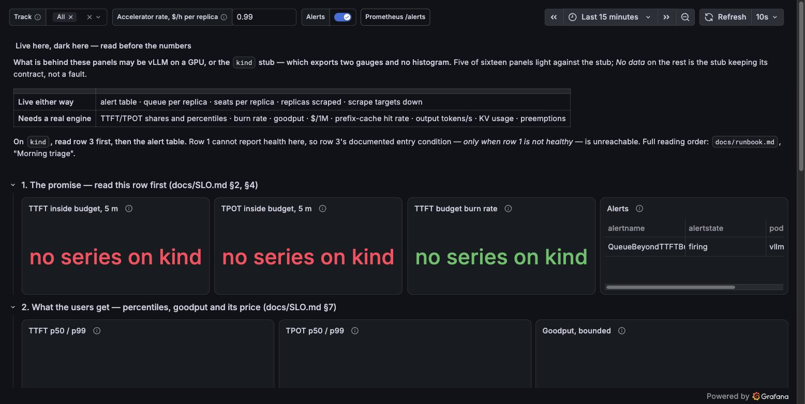

# Observability

One Prometheus, two alerting rules, one Grafana dashboard. Prometheus is here
first as the autoscaler's input (`../keda/README.md`); the rules and the
dashboard were added later, on the same server. The SLO the rules and panels read is
`docs/SLO.md` §2, and which SLI, which window and which burn rate is derived in
§4 of the same file, "The alert rule" — not restated here. How the dashboard is
read at 03:00 is `docs/runbook.md`, "Morning triage" — not restated here either.

| Path | What it is |
|---|---|
| `prometheus/prometheus.yml` | Scrape config: one target per vLLM Pod via endpoint discovery, so `sum()` in a query describes the fleet. Admits both tracks' Services and stamps the Service name as `service`, so a canary is scraped and can be told from stable in a query (`../manifests/overlays/kind-canary`). |
| `prometheus/rules.yml` | Two alerting rules on the TTFT objective: the SLI from the engine's histogram, and the queue proxy that can be tested without an engine. |
| `prometheus/` (rest) | Namespace, RBAC for discovery, Deployment with 2 h retention, Service. `kubectl apply -k` this directory; the full order is `docs/running-on-kind.md`. |
| `grafana/dashboards/vllm-slo.json` | The one dashboard, as the file Grafana loads. Three rows in triage order — the promise, what users get and its price, where the gap is — and every panel's *description* says which section of `docs/SLO.md` it reads and whether it lights on `kind`. |
| `grafana/` (rest) | Deployment reading three ConfigMaps by provisioning (datasource, dashboard provider, the JSON), Service. No login, viewer only, nothing persisted: the file is the dashboard. `kubectl apply -k` after `prometheus/`; reaching it is one port-forward, in `docs/running-on-kind.md`. |

There is no Alertmanager. "Fires" in this directory means the rule's state at
`/alerts` reads `firing` and the `ALERTS` series carries it — which is what the dashboard's *Alerts*
table and its annotations read; delivering that to
a person is a later component.

## Why two rules for one objective

`TTFTBudgetBurning` reads the SLI itself — the share of requests with TTFT inside
the budget, from `vllm:time_to_first_token_seconds` — and pages at a burn rate
of 14.4 over both a 1 h and a 5 m window. It cannot be tested on `kind`: the
stub exports no histogram on purpose, so the rule evaluates to an empty vector
there. It is loaded, healthy and untested until a card.

`QueueBeyondTTFTBudget` reads the consequence §4 derived from the queue budget:
a request that is queued at all has already missed the TTFT budget. It fires
when any one replica has held a queue for longer than the scaler's control loop
— `max by (pod)`, not `sum()`, because the scaler already reads the sum and
answers it with replicas; this rule reads what the replicas did not clear.

## The dashboard, and what `kind` can show of it

Three decisions, in the order they were taken.

**It is a file.** `grafana/dashboards/vllm-slo.json` is provisioned at start-up
and the provider forbids UI saves, so the dashboard is reviewed as a diff and a
fresh cluster gets the same one. The cost is that a panel fixed in the browser
at 03:00 is lost on the next roll; the fix goes into the file, and the ConfigMap
generator rolls the Pod on that edit. Grafana `13.2.1` accepts no anonymous role
but Viewer (it logged the `org_role` setting as deprecated when Admin was tried),
which matched the decision rather than fought it; ad-hoc PromQL is Prometheus's
own UI on 9090.

**The rows are the triage order, and the alerting rules' numbers are the
panels' numbers.** Row 1 reads the SLIs the way `rules.yml` reads them — the
`le="0.25"` bucket over the count, on the same 5 m and 1 h windows, burn rate
over the same 1 % — so a red stat and a firing rule cannot disagree about the
number. The TPOT share reads `le="0.05"`, an edge the engine's per-request TPOT
histogram happens to have, so it is exact where the TTFT share is 50 ms strict.
The p50/p99 time series are `histogram_quantile` and say so in their
descriptions: pictures, interpolated between edges; the stats are the numbers
to defend.

**Goodput is drawn as a band, and cost follows it.** TTFT and TPOT arrive as
two histograms with no per-request join, so which requests met *both* targets
is not a server-side quantity. Completions × the smaller good share is an upper
bound on goodput; completions × (share_TTFT + share_TPOT − 1), floored at zero,
a lower one — and the SLO-respecting `$/1M` line uses the lower bound, so it is
an upper bound on cost. The exact figure is the client's `--goodput`
(`docs/GLOSSARY.md`). A thin band is a healthy service; a dashboard that drew
one line here would be reporting a number the engine never measured.

What lights on `kind` follows from `../manifests/README.md`: the stub exports
two gauges and no histogram or counter, on purpose.

| Panel | On `kind` | On a card |
|---|---|---|
| Alerts table; annotations | ✅ the queue rule, pending and firing | both rules |
| Queue per replica; seats per replica | ✅ | ✅ |
| Replicas scraped per track; scrape targets down | ✅ | ✅ |
| TTFT and TPOT shares, burn rate, p50/p99 | *No data* | ✅ |
| Goodput band; `$/1M`; `h`; output tokens/s | *No data* | ✅ |
| KV cache usage; preemptions | *No data* | ✅ |

Five panels of sixteen, and *No data* on the rest is the stub keeping the
rule that split `../manifests/` in two — a fabricated histogram would light
them and mean nothing.

## Observed on kind, 2026-09-07

The breach below, re-run on a cluster built from scratch with Grafana applied
after Prometheus. Same fixtures, same 24 streams; what was new is what the
dashboard showed while the rule walked to `firing`:

    t=0        24 streams opened            1 replica
    t=+11 s    QueueBeyondTTFTBudget pending
    t=+85 s    4 replicas scraped           queue panel: 20 / 0 / 0 / 0 by pod, seats 4 / 0 / 0 / 0
    t=+2m11s   firing                       Alerts table names the one Pod; red annotation on every time series

One thing the run refuted: a 256Mi memory limit for Grafana. The container was
`OOMKilled` (exit 137) about a minute after start while one browser rendered
the dashboard, and every panel read *No data* for the seconds it took to come
back — a blank dashboard that was Grafana's fault, not the metrics'. The limit
is 512Mi now, and the number is the one thing in `grafana/deployment.yaml`
that was measured rather than chosen.

And one thing the picture showed that the `curl` runs could not: every per-Pod
line appeared twice. `prometheus.yml` stamps `endpoint_ready` onto each target,
and a Pod flips it from `false` to `true` once its readiness probe passes — one
Pod, two label sets, two series with the same legend. The per-Pod panels now
read `max by (service, pod)`, which folds the flip away; the rule's
`max by (pod)` had been doing the same thing for the same reason without
anyone having drawn it.

Every query in the JSON was run against Prometheus's API at the same time:
all 22 parsed, the five panels above returned series, the seventeen queries
below returned an empty vector — the table above, measured rather than asserted. The values are
the same ones the 2026-09-03 run read with `curl`; the dashboard added no
number, and it was not meant to.

## Pictures of it, 2026-09-11

The breach reproduced a third time, on a cluster built from scratch, and this
time photographed — it had been reproduced twice before with no picture taken.
Same 24 streams, same fixtures, and the rule behaved as recorded: `pending`
within one evaluation tick of the load starting, `firing` one `for: 2m` later.
The 09-07 timeline above reads +2m11s and this run +2m10s, which is **not** a
run-to-run agreement to the second — `evaluation_interval` is 15 s
(`prometheus/prometheus.yml`), so a one-second difference is the phase of the
evaluation grid. What reproduced is `for: 2m`, not a timestamp.

The top of the dashboard while the alert is `firing`. It is also what the
live/dark contract looks like in place: three stat panels reading *no series on
kind* beside an alert table that works, because the queue rule stands on a gauge
the stub genuinely serves. The reading order this forces is in
`../../docs/runbook.md`, "Morning triage".

And the cause, one row further down: the queue on the Pod that took the 24
streams goes to 20 and stays there, the three replicas KEDA adds sit at 0 because
the clients are already attached, and the threshold line at 1 is the rule's. The
shaded band is `firing` and its **left** edge is the moment of the transition:
the dashboard's only annotation query is `ALERTS{alertstate="firing"}`, so
`pending` is never drawn on a time series and is visible in the alert table
alone. A reader who has only seen that table knows something is wrong; this panel
is where *queue or floor* gets answered.

## Observed on kind, 2026-09-03

Fixtures: the stub's 4 seats per replica, `maxReplicaCount` 4, KEDA's
`threshold: "2"` and 30 s scale-down window from `../keda/overlays/kind`. None
of the numbers below is a performance number.

The breach: 24 streamed completions opened in the same second, each held for
`max_tokens` 12 000 × 20 ms of fake decode, against 16 seats at full scale.

    for i in $(seq 24); do
      curl -sN -o /dev/null -X POST localhost:8080/v1/completions \
        -H 'Content-Type: application/json' \
        -d '{"model":"Qwen/Qwen3-8B","prompt":"x","max_tokens":12000,"stream":true}' &
    done

Read every 15 s from `kubectl get deploy`, `/api/v1/query` and `/api/v1/alerts`:

    t=0        1 replica    waiting 0                      no alert
    t=+11 s    4 replicas   waiting 20 / 0 / 0 / 0         QueueBeyondTTFTBudget pending
    t=+2m13s   4 replicas   waiting 20 / 0 / 0 / 0         firing
    t=+6m05s   clients killed
    t=+6m18s   4 replicas   waiting 0                      no alert
    t=+6m33s   1 replica    waiting 0                      scaled in after the 30 s window

Three things in that table were worth the run.

**The `for` window did what it is for.** Pending at the first evaluation after
the load, firing one evaluation after 2 min had elapsed. Resolution took one
evaluation once the queue read zero — the short side of the asymmetry is the
one that matters for a page that should stop.

**The scaler responded and the metric did not move.** Twenty-four connections
that arrive in one instant are routed to the one endpoint that exists in that
instant. KEDA read `sum` = 20, scaled to four, and `sum` stayed 20 for six
minutes: three replicas sat at zero because an in-flight stream cannot be handed
to a Pod that did not exist when it was routed. The scaler's metric described a
load its response could not reach, which is the case `max by (pod)` exists for —
`sum()` would have paged with the same number the scaler was already acting on;
per pod, the alert names the replica that is stuck. What this says about a real
fleet is bounded: real arrivals are spread in time and new replicas take the
arrivals that follow them, so the instant burst is the worst case, not the
typical one.

**Killing the clients emptied a 16-deep queue in one scrape interval.** The stub
learns of a departed client at its next write and frees the seat; each queued
ticket then took a seat, wrote once, failed, and left. That is the streamed path
of `../manifests/README.md` point 3 seen from the queue's side.

## Not measured here

- `TTFTBudgetBurning` firing — needs an engine with the histogram, i.e. a card.
- Whether 14.4 and the 30-day budget period are the right numbers for this
  service — `docs/SLO.md` §4 names them as policy, and a page threshold is
  tuned against pages received, which none have been.
- Every panel in the *No data* rows of the table above, on a card — including
  whether the goodput band is thin on real traffic, which is the one claim in
  the dashboard that a card could refute.
- Whether the `service` variable's per-track view of the histogram panels is
  what a canary decision needs on a card, or whether the burn-rate rule wants a
  per-track split too (`../manifests/README.md`, "Not measured here").
