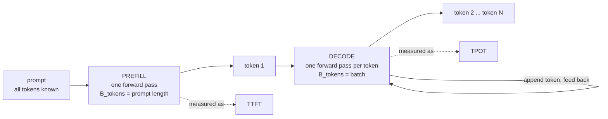
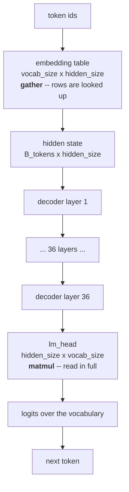
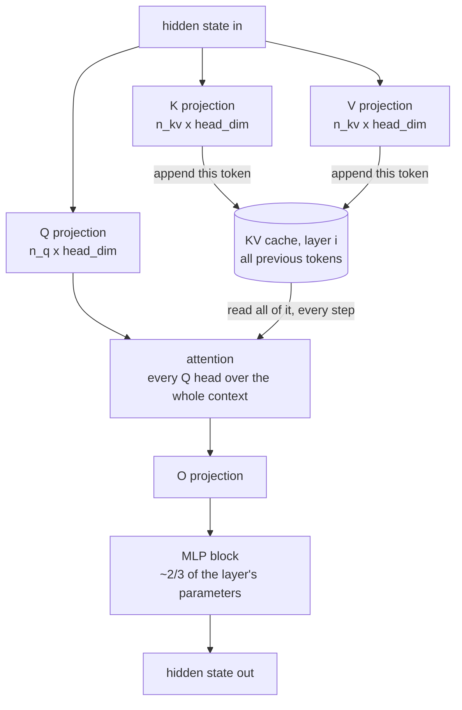
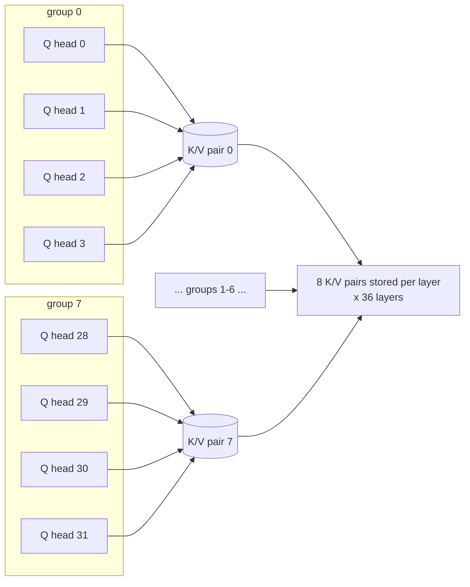
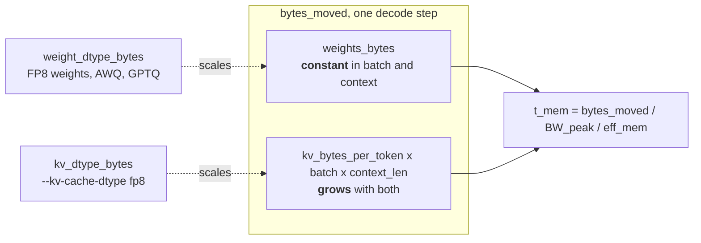
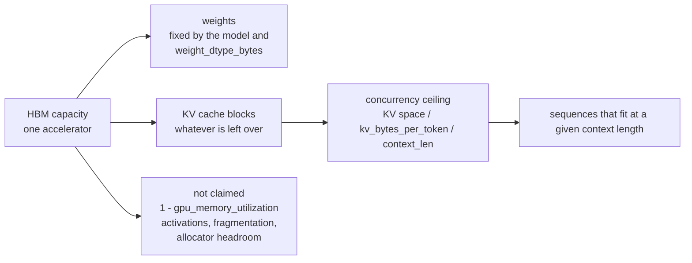

# Model anatomy — where the bytes are

Why this file exists: every figure in [SLO.md](SLO.md) is an accounting of bytes
moved through HBM, and that accounting is only obvious once the shape of the model
producing those bytes is in view. This file draws that shape at five zoom levels
and stops there. It holds **no numbers of its own** — architecture values come from
`config.json` as tabulated in [SLO.md](SLO.md) §3, and every derived quantity is
derived there. Vocabulary is [GLOSSARY.md](GLOSSARY.md); the code is
`bench/roofline.py`.

The model drawn is the repo default, `Qwen/Qwen3-8B`: `L` = 36 layers,
`n_q` = 32 query heads, `n_kv` = 8 KV heads, `head_dim` = 128, `hidden_size` = 4096,
`vocab_size` = 151 936, weights BF16.

| Level | Question it answers |
|---|---|
| 1 | Why are there two phases, and why do they behave differently? |
| 2 | What does one forward pass read, end to end? |
| 3 | Where does the KV cache physically come from? |
| 4 | Why `n_kv` and not `n_q` in the KV formula? |
| 5 | What fills the card, and what limits concurrency? |

---

## Level 1 — two phases from one property

Generation is autoregressive: token *k+1* cannot be computed before token *k*
exists. The prompt is exempt, because all of it is known up front.

One structural difference, `B_tokens`, produces every downstream difference:
prefill lands compute-bound, decode memory-bound. An N-token answer costs one
prefill pass and N−1 decode passes, which is why decode dominates the bill.

Floors for both: [SLO.md](SLO.md) §4.

---

## Level 2 — one forward pass, whole model

Three things this level fixes:

**The embedding table and `lm_head` are not the same kind of object**, though for
this model they are the same size. A gather touches only the rows named by the
input ids; a matmul reads the whole matrix and performs arithmetic on it. This is
the entire reason `Model` carries two parameter counts — see the note on
approximation error below.

**The 36 layers are identical in shape**, so per-layer quantities multiply by `L`.
That `L` is the trailing factor in `kv_bytes_per_token`.

**Weights are read once per pass**, whatever `B_tokens` is. The hidden state that
flows down the diagram grows with `B_tokens`; the matrices it passes through do
not.

> **Where the two parameter counts are each slightly wrong.** `P_total` (memory)
> counts the embedding table as fully read, which a gather does not do. `P_compute`
> (FLOPs) drops both vocab-sized matrices, but `lm_head` is a real matmul and does
> contribute. The two errors point in opposite directions and are each far smaller
> than the margin by which the roofline is won on either side, and smaller than the
> `eff_mem` / `mfu` error bars ([SLO.md](SLO.md) §9). Stating that out loud is the
> point; correcting it would be false precision.

---

## Level 3 — inside one decoder layer

This is the only level where the KV cache is created, and it is created once per
layer — which is where `L` enters the formula.

Read the two arrows into and out of the cache as the whole story of decode:

- **Write:** one token's K and V per sequence per layer. Tiny, and linear in
  `batch`.
- **Read:** the *entire* cache for every running sequence, on *every* decode step.
  This is the term that grows as `batch × context_len`, and the reason decode is
  memory-bound.

Q is never cached. It is recomputed each step from the current token's hidden state
and discarded, which is why `n_q` does not appear in the cache size at all.

Omitted from the drawing because they move a negligible share of the bytes:
RMSNorm before each block, and the residual connection that adds each block's
output back onto the hidden state.

---

## Level 4 — GQA: why `n_kv`, not `n_q`

Under MHA every query head owns a private K/V pair. Under GQA the query heads are
partitioned into `n_kv` groups, and a group shares one pair. Qwen3-8B runs 32 query
heads over 8 KV heads, so groups are four wide.

The trade this makes:

| Side of the roofline | Effect of GQA |
|---|---|
| Compute | ~unchanged — 32 head-attentions still run |
| Memory | divided by `n_q / n_kv` |

Paying on the free side of the roofline to save on the binding one is why every
current serving model ships GQA. The saved factor and what it buys in sessions:
[SLO.md](SLO.md) §3 and §6. MHA and MQA are the two ends of the same axis
([GLOSSARY.md](GLOSSARY.md)).

**Not to be confused with prefix caching.** GQA shares KV heads *within* one
sequence. Reusing KV *between* requests that share a prompt prefix is a separate
mechanism operating on whole cache blocks.

---

## Level 5 — what fills the card

Two views of the same memory. First, the composition of one decode step's traffic:

The two dtype knobs are separate fields in `bench/roofline.py` precisely because
they scale different terms, and therefore pay off in opposite regimes: halving the
weight term matters most at `batch` = 1, halving the KV term matters most at a full
card. [SLO.md](SLO.md) §5 puts numbers on both ends.

Second, the static layout of HBM once the server is up — this is what
`gpu_memory_utilization` divides and what the concurrency ceiling counts:

Concurrency ceiling = KV space ÷ `kv_bytes_per_token` ÷ `context_len`. Where that
lands for this model, and why memory capacity and the latency budget bind at
almost the same point, is [SLO.md](SLO.md) §6.

---

## When these drawings stop being true

Every level above assumes a dense, GQA, full-attention transformer. MoE splits the
parameter count in two, MLA replaces the per-head cache with a latent, sliding
window attention stops the cache growing past a fixed length, and quantization
detaches `weight_dtype_bytes` from `kv_dtype_bytes`. Each is described in
[GLOSSARY.md](GLOSSARY.md) § *Architectures that break the standard arithmetic*.

And the standing rule: vLLM logs its actual KV cache size and block count at
startup. That log outranks every diagram here ([SLO.md](SLO.md) §9).
